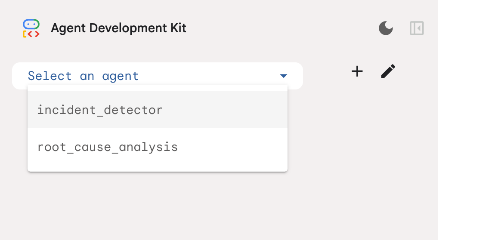
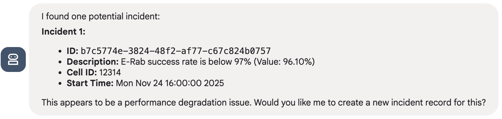
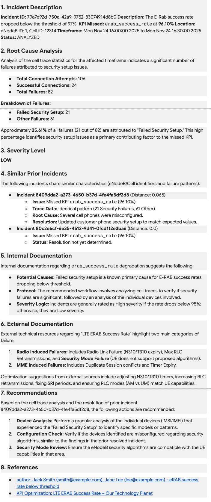

# Anomaly Detection and Root Cause Analysis in Telco Autonomous Network Operation

This project shows how an LLM-based agent can proactively detect anomalies, perform root cause analysis (RCA) of incidents in
telecommunication networks and suggest remedial actions.

We thank DigitalRoute (https://www.digitalroute.com/) for providing us with synthesized, realistic eNodeB performance management (PM) data and cell traces and sharing their insights into common radio access network (RAN) and User Equipment (UE) issues with us.

# Costs
This demo uses several billable components of  Google Cloud. You can file pricing information in the links below:

- [BigQuery](https://cloud.google.com/bigquery/pricing)
- [Vertex AI](https://cloud.google.com/vertex-ai/pricing)

To generate a cost estimate based on your projected usage, use the
[pricing calculator](https://cloud.google.com/products/calculator).

When you finish this demo, you can avoid continued billing by deleting the
resources you created. For more information, see the
[Cleanup](#cleanup) section of this document.

# Setting up the environment

## Getting Started with the Terraform

### Prerequisites

You need to have access to a Google Cloud project with an active billing account.

### Creating infrastructure

1. Clone this repo and switch to the checked out directory
2. Designate or create a project to create all the artifacts
3. Create `infrastructure/project-setup/terraform.tfvars` file with
   the following content:

```text
project_id = "<your project id>"
```

4. Run Terraform scripts which will enable required APIs for this project

```shell
cd infrastructure/project-setup
terraform init 
terraform apply
```

5. Create `infrastructure/terraform/terraform.tfvars` file with
   the following content:

```text
project_id = "<your project id>"
bigquery_data_project_id = "<project where BigQuery dataset will be created>"
```

There are additional variables that can be provided in that file to further customize the
deployment.
Please check [infrastructure/terraform/variables.tf](infrastructure/terraform/variables.tf) for
detail.

6. Create infrastructure to run the demo:

```shell
cd infrastructure/terraform
terraform init
terraform apply
```

## Created artifacts

After the Terraform scripts successfully complete, the following artifacts are created in your
project:

* BigQuery dataset `telco_demo`. This dataset contains three tables:
    * `performance` - LTE performance data
    * `performance_kpi` - materialized view of the `performance` table with several calculated KPIs.
    * `cell_traces` - Cell trace data
    * `incidents` - Incident details

* Vertex AI Search repository
    * Data store for RCA rules, `rca_rules`, and the corresponding data store schema
    * Search app connected to that data store, `rca_rules_search`

## Populate data

Run the following scripts to populate the performance and cell traces tables with synthetic data:

```shell
bin/load-performance-data.sh
bin/load-cell-traces-data.sh
```

Run this script to populate the Vertex AI Search with RCA rules:

```shell
bin/add-rca-rules.sh
```

## Set up the Python environment

In the `agents` directory, create a Python's virtual environment and install ADK:

```shell
python -m venv .venv
source .venv/bin/activate

pip install google-adk==1.21.0
```

# Running the agent

## Running the agent in the ADK Development UI locally

While you are still in the activated virtual environment and in the `agents` directory, run:

```shell
adk web
```

## Incident detection and creation

In real production environment, this step most likely will be done using an automated process. For
our demo, we use an agent to do that.

In the ADK UI, select the `incident_detector` agent as shown below:



Use this, or similar, prompt to start the process: "Check if there are any new incidents".

You should see a response similar to this:


Confirm that you would like to create the incident and verify that the agent finishes that task
successfully. Copy the ID of the incident - you will need it in the next step.

_Note_: there is no checkpointing implemented in this agent. Every time you run this flow it will
create a similar incident. In production environment, the search for anomalies would start from the
point where the last search finished.

## Root cause analysis

In the web UI, switch the agent to the `root_cause_analysis` one.

Type a prompt like this: "Analyse incident <incident id>". The agent process the incident and
generate a report similar to this one:



# Cleanup
If you created the infrastructure in a dedicated project you can just delete this project.

Otherwise, you can run the following script:

```shell
terraform -chdir infrastructure/terraform destroy 
```

# Contributing

Contributions to this library are always welcome and highly encouraged.

See [CONTRIBUTING](CONTRIBUTING.md) for more information on how to get started.

Please note that this project is released with a Contributor Code of Conduct. By participating in
this project you agree to abide by its terms. See [Code of Conduct](CODE_OF_CONDUCT.md) for more
information.

## License

Apache 2.0 - See [LICENSE](LICENSE) for more information.

